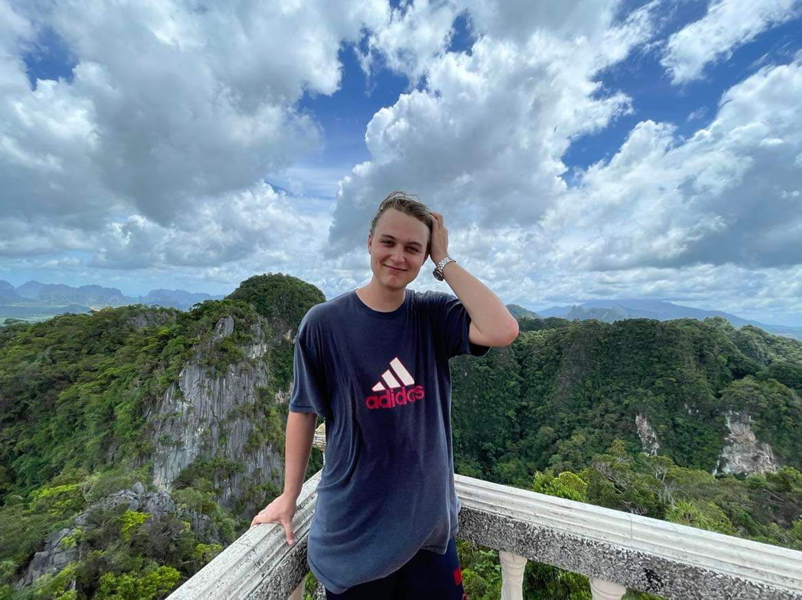

<meta name="viewport" content="width=device-width, initial-scale=1.0">
<link href="//maxcdn.bootstrapcdn.com/bootstrap/4.1.1/css/bootstrap.min.css" rel="stylesheet" id="bootstrap-css">

<link rel="stylesheet" href="https://stackpath.bootstrapcdn.com/font-awesome/4.7.0/css/font-awesome.min.css">
<link rel="stylesheet" type="text/css" href="css/main.css">
 
 <!--text and image-->
 

    <!--List of teammates-->
    

      <!--Jinyue-->
      <li class="col-12 col-md-6 col-lg-4" style="list-style-type: none">
          

            <figure style="margin:auto;">
            <!--img-->
            
            </figure>
            <h3 style="text-align:center">Jinyue Liu</h3>
            
Senior Research Scientist

            
Ph.D. in Neurobiology, Harvard University, USA 

            
B.A. in Natural Sciences, University of Cambridge, UK 

          

      </li>
       <!--Judy-->
      <li class="col-12 col-md-6 col-lg-4" style="list-style-type: none">
          

            <figure>
            <!--img-->
            
            </figure>
            <h3 style="text-align:center">Judy Saw</h3>
            
Assistant Lab Manager

            
M.Sc National University of Singapore

            
 

        

      </li>
       <!--Sui Ping-->
      <li class="col-12 col-md-6 col-lg-4" style="list-style-type: none">
          

            <figure>
            <!--img-->
            
            </figure>
            <h3 style="text-align:center">Sui Ping Ong</h3>
            
Senior Research Officer

            
B.Sc National University of Singapore

          

      </li>
    

    

       <!--Matas-->
      <li class="col-12 col-md-6 col-lg-4" style="list-style-type: none">
          

            <figure style="margin:auto;">
            <!--img-->
            
            </figure>
            <h3 style="text-align:center">Matas Vitkauskas</h3>
            
Research Officer

            
B.Sc Yale-NUS College, Singapore

          

      </li>
       <!--Jonathan-->
      <li class="col-12 col-md-6 col-lg-4" style="list-style-type: none">
          

            <figure>
            <!--img-->
            
            </figure>
            <h3 style="text-align:center">Jonathan Jayadi</h3>
            
Undergraduate Intern

            
Senior at Atma Jaya Catholic University of Indonesia

          

      </li>
    

  

